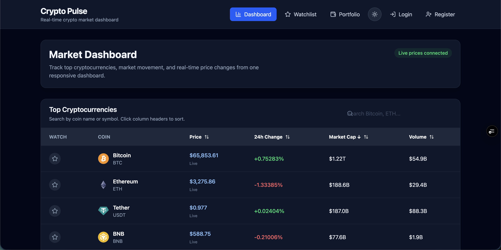

# Crypto Pulse

Crypto Pulse is a full-stack real-time cryptocurrency dashboard built with React, Node.js, Express, MongoDB, Socket.IO, and CoinGecko API.

The platform allows users to view live crypto market data, search and sort coins, inspect coin details, create an account, save a watchlist, simulate a portfolio, edit holdings, view allocation charts, and switch between light/dark mode.

## Live Demo

Frontend: https://crypto-project-psi-pearl.vercel.app/
Backend API: https://crypto-project-lgb9.onrender.com/

## GitHub Repository

https://github.com/ye-moe/crypto-project

---

## Features

- Responsive crypto market dashboard
- Real-time price updates using Socket.IO
- CoinGecko API integration
- Backend API caching and fallback handling
- Search, sorting, and pagination for market data
- Coin detail pages with historical price charts
- JWT authentication
- MongoDB-backed user accounts
- Database-backed watchlist
- Portfolio simulator with:
  - Add holdings
  - Edit holdings
  - Delete holdings
  - Total invested calculation
  - Current value calculation
  - Profit/loss calculation
  - Allocation pie chart
- Light/dark mode toggle
- Responsive UI for desktop and mobile

---

## Tech Stack

### Frontend

- React
- Vite
- Tailwind CSS
- React Router
- Axios
- Recharts
- Socket.IO Client
- Lucide React

### Backend

- Node.js
- Express.js
- MongoDB
- Mongoose
- JWT
- bcryptjs
- Socket.IO
- CoinGecko API

### Deployment

- Frontend: Vercel
- Backend: Render
- Database: MongoDB Atlas

---

### Dashboard


## Project Structure

```txt
crypto-platform/
├── client/
│   ├── src/
│   │   ├── api/
│   │   ├── components/
│   │   ├── context/
│   │   ├── hooks/
│   │   ├── pages/
│   │   └── App.jsx
│   └── package.json
│
├── server/
│   ├── src/
│   │   ├── config/
│   │   ├── controllers/
│   │   ├── data/
│   │   ├── middleware/
│   │   ├── models/
│   │   ├── routes/
│   │   ├── services/
│   │   ├── sockets/
│   │   └── server.js
│   └── package.json
│
└── README.md
